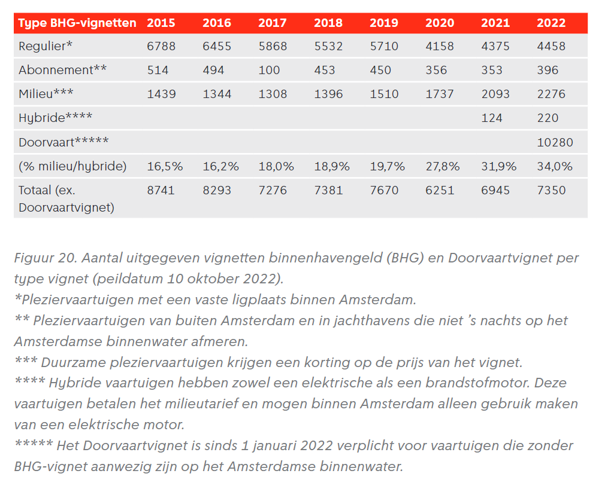
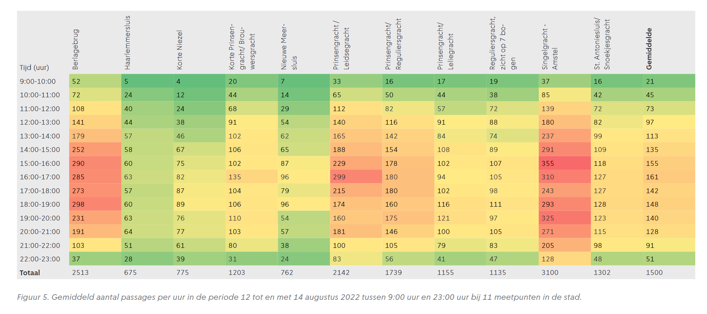
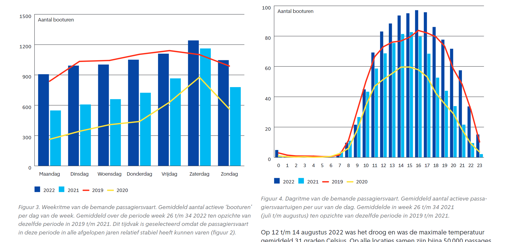
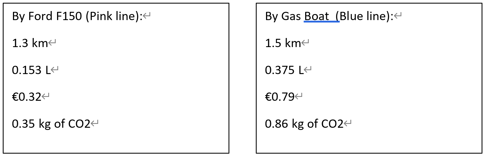
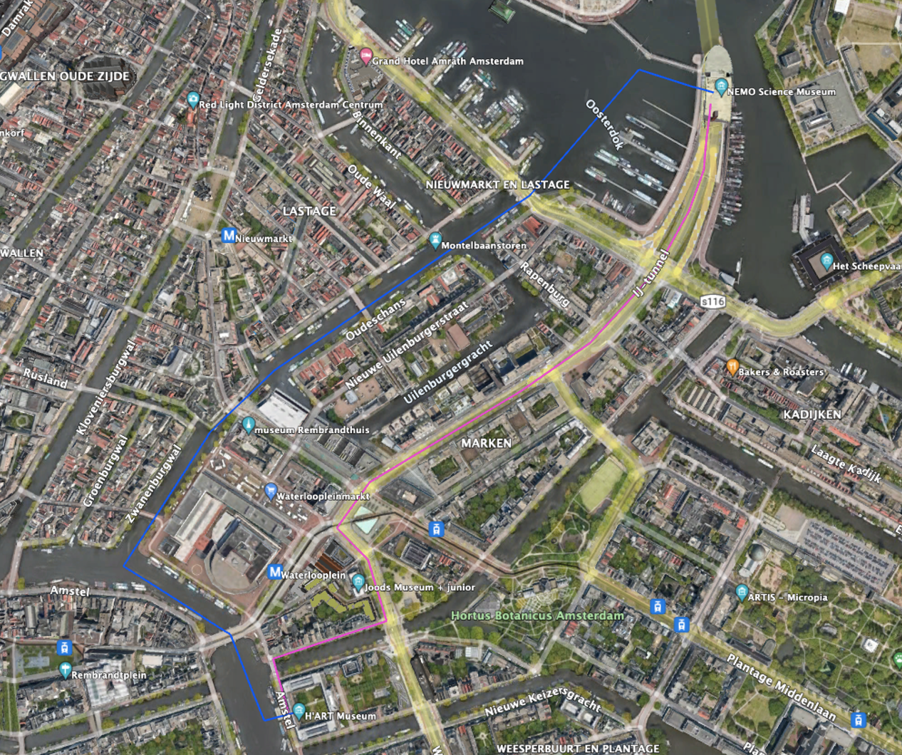
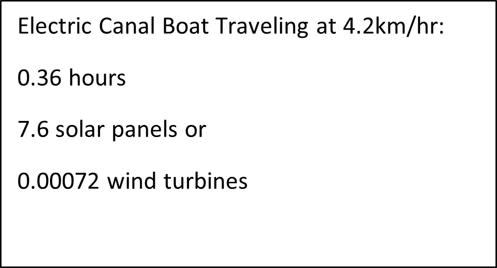
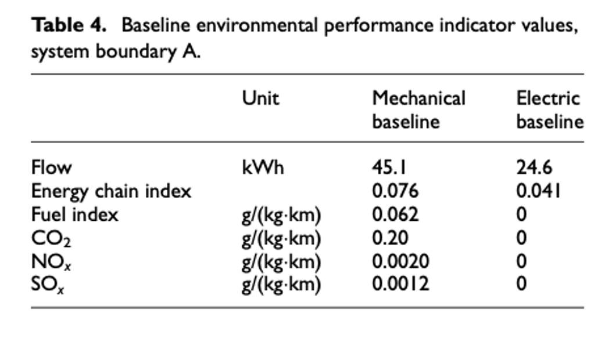

## Background:

Paris is hosting the Paralympics in 2024. One of the events at the Paralympics is an open water swimming event in the Seine (apparently the water is clean or so the French say). Since the City of Amsterdam thinks it is better than Paris, they want to host an event before the Paralympics, snubbing the Parisians. The idea is to host a 5km. open water swimming event through the canals of Amsterdam. You are asked by the municipality of Amsterdam to advise on the feasibility of the event from the perspective of the safety of the partaking athletes from an environmental perspective. The event is going to be hosted in May.   

The Municipality is worried that the canal- and support boats might pollute the air with their diesel engines. Since the Municipality wants to create ideal conditions for the swimmers so they can set records (always nice for PR), it is your task to figure out if their concern is warranted and what should or could be done to improve conditions. Next to that, Amsterdam wants to advertise this event as a Neutral Energy Event©™® (NEE).

## Our Solutions:

### Question 1： How many of the canal boats currently in use are diesel/fossil fuel driven and how many boats are electrical driven?  

According to city spokesman Wouter Keuning, 75% of the cities commercial vessels are qualifying as emission free. In contrast, of the 12.000 recreational vessels in the city of Amsterdam only 5% are emission free, meaning that the vast majority is diesel/ fossil fuel driven.  The table below displays the BHG vignettes issued for different years. This indicates the number of recreational vessels that got a vignette (a sort of license) to sail on the canals.  In 2022 220 hybrid recreational vessels got a vignette, whereas there were over 4400 regular vehicles that got a license for access to the canals. This also shows the vast majority of vessels in the Amsterdam canals being diesel/ fossil fuel powered.    

Links:  
https://safety4sea.com/amsterdam-canal-boats-go-electric-ahead-of-2025-diesel-ban/   
https://openresearch.amsterdam/nl/page/92981/grachtenmonitor-2022 

### Question 2： Are there peak times for the canal boats?

The data above is from the Amsterdam Canal Monitor report of 2022. The graph on the bottom left shows a peak in the weekends. The graph on the bottom left and the table at the top go in more detail about daily peaks of the canal boats. The graph on the bottom left shows an increase in passage during the morning, a peak in the afternoon, and a decrease in the evening. The table includes not only on peaks during the day but also the variety between different measuring points throughout Amsterdam. The Berlagebrug, the Prinsengracht/ Leidsegracht and the Singelgracht are much more crowded than other locations. This could be because of the popular locations of these measuring points. The general trend, however, is similar to that presented in the graph on the bottom right. Increases in the morning, peaks in the afternoon and early evening and a decrease in the late evening. 

Links: 
https://openresearch.amsterdam/nl/page/92981/grachtenmonitor-2022 

### Question 3： Try to compare the energy use of the canal boats to some other activities in the city. Use canal boats more or less energy in relation to their carbon footprint compared to these other activities? 

These values were calculated using typical gas narrowboat (around 15 meters) and a 2015 Ford F150 tank and fuel efficiencies. For the gas narrowboat, at cruising speed the boat uses around 1.5L per hour and has an assumed speed of 6km/hr (the maximum speed allowed for Amsterdam). If the boat is traveling slower than 6km/hr (most likely scenario) then the fuel consumption will be greater (around 2km/L instead of 4km/L), therefore the CO2 emissions and price will both increase accordingly. However, this does not consider the power required to accelerate to 6km/hr versus 4km/hr. The Ford F150 travels at 8km per 1 L of fuel. For both scenarios, an average amount of 2.3 kg of CO2 and €2.11 per L of gas were used. 

Links:   
https://www.insure4boats.co.uk/blog/archive/narrowboat-fuel/  
https://www.guideautoweb.com/en/articles/27370/ford-f-150-s-fuel-consumption-the-epa-has-spoken/  
https://natural-resources.canada.ca/sites/www.nrcan.gc.ca/files/oee/pdf/transportation/fuel-efficient-technologies/autosmart_factsheet_6_e.pdf  
https://www.globalpetrolprices.com/Netherlands/gasoline_prices/

### Question 4： Would you consider it economically feasible? 

In order to host a 5km open water swimming event through the canals of Amsterdam it is safe to assume that vessels might have to be redirected or temporarily moved to another place where the vessels can dock that are currently docked in the canal. The cost in terms of fuel for the majority of these vessels would be  €0.53 per kilometer of a gas fueled vessel and €0.46 per kilometer of a diesel fueled vessel. Depending on the number of vessels that would have to be redirected for the event to take place, it determines how much it would cost to reimburse the owners of the vessel for moving their vessel. This is just an example of a cost that would come with hosting this event.  
However, from an environmental perspective, which is the focus of the municipality, water quality is the most important. Water quality of the canals mostly depends on weather events of the period beforehand. If there is heavy rainfall, the canals might be polluted with sewerage water, which would result in cancelation of the event, which would come with high costs. An extreme alternative would be to ensure that there is separate sewerage before an event like this takes place but this would also come with high cost and it is not very likely that this will be realized before the Paris event.   
As we have tried to show with the examples above, economic feasibility largely depends on willingness and availability of funds. In this case, we have no access to any economic data on the funds that the municipality is willing to spend on this event. Furthermore, the costs of the event largely depend on weather circumstances, the staff that would have to be hired, or whether the event is on a voluntary basis. In case of enough availability of funds, good weather conditions and low level of pollutions, we would consider the event economically feasible. 

Links:   
https://www.globalpetrolprices.com/Netherlands/gasoline_prices/   
https://www.guideautoweb.com/en/articles/27370/ford-f-150-s-fuel-consumption-the-epa-has-spoken/  
https://natural-resources.canada.ca/sites/www.nrcan.gc.ca/files/oee/pdf/transportation/fuel-efficient-technologies/autosmart_factsheet_6_e.pdf  

### Question 5： How many support boats and vehicles are needed for the Paralympics event only. 

In the Amsterdam City Swim, there was a resting/ first aid platform on the water every 500 meters. Supporters were standing on the canal walls, rather than on boats in the canals. Furthermore, the event requires lots of lifeguards, but they seem to be on the side of the canals as well. This means for a race of 5km, at least 10 resting/ first aid platforms/ boats are required in the canals. However, if part of the race takes place in open water, more boats might be required. In the Rottnest Channel Swim, over a 1000 safety boats and over 500 kayaks were used.   

Links:   
https://www.amsterdamcityswim.nl/english  
https://www.swimmingworldmagazine.com/news/open-water-swimmer-are-not-limited-to-eight-lanes-in-the-pool-but/

### Question 6： If only clean energy can be used, how many solar panels or wind turbines are needed? 

These calculations were based off tables I, 3, 4, and 5 from waternet, and the estimated power values for wind turbines and solar panels. One typical solar panel produces around 1kwh and 0.29 kw. One typical wind turbine produces around 6 million kwh per year and 2750 kw. It is also assumed that one typical electric boat weighs 12 tons and it requires 0.5 kw per ton of weight to get the boat to a 70% efficient speed. 

Links:  
https://www.waternet.nl/siteassets/innovatie/maritime-envorimental-performance-indiocators-for-urban-waterways-in-amsterdam.pdf  
https://www.usgs.gov/faqs/how-many-homes-can-average-wind-turbine-power  
https://www.usgs.gov/faqs/how-many-homes-can-average-wind-turbine-power  

### Question 7： Would there be any effect on the water quality if there are less/no canal boats using fossil fules? 

The table above displays the environmental performance indicators values for different types of baselines of vehicles. As the table shows, for a mechanical baseline, the emissions of CO2, NOx, SOx are 0.20, 0.0020 and 0.0012 respectively. For an electric baseline, these values are all 0. Therefore, the water pollution as a result of diesel/ fossil fuel powered vessels would decrease to 0 when electric vessels would be used. However, as mentioned earlier, water quality does not merely depend on the pollution form vessels on the water. Pollution from sewerage as a consequence of heavy rainfall is also a big contributor to water pollution. This should be considered in organization of this event. 

Links:   
https://www.waternet.nl/siteassets/innovatie/maritime-envorimental-performance-indiocators-for-urban-waterways-in-amsterdam.pdf 

### Limitation:
