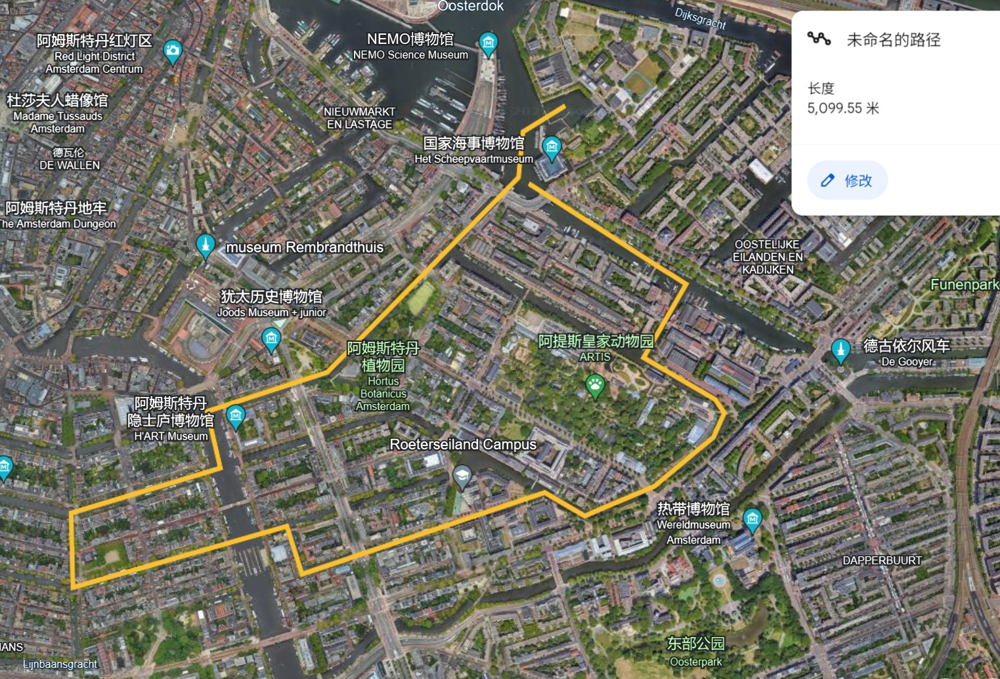
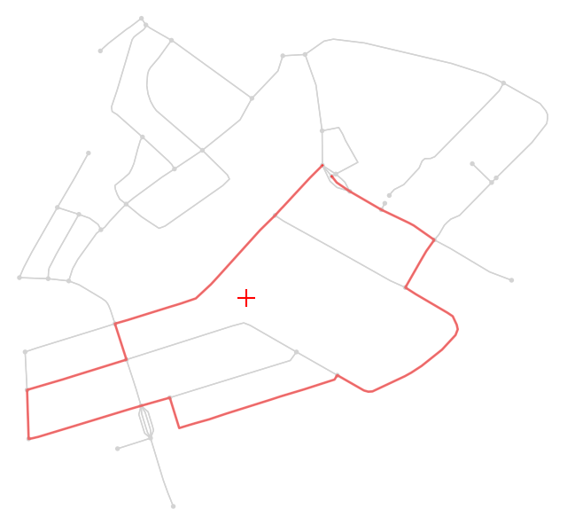

## Background:

Paris is hosting the Paralympics in 2024. One of the events at the Paralympics is an open water swimming event in the Seine (apparently the water is clean or so the French say). Since the City of Amsterdam thinks it is better than Paris, they want to host an event before the Paralympics, snubbing the Parisians. The idea is to host a 5km. open water swimming event through the canals of Amsterdam. You are asked by the municipality of Amsterdam to advise on the feasibility of the event from the perspective of the safety of the partaking athletes from an environmental perspective. The event is going to be hosted in May. 
For this exercise you need the data from this website. Download the Basis Bestand Gebieden Amsterdam (BBGA), both the data and the documentation. You already have the AirBnB data from Amsterdam from the workshop exercise.
The Municipality of Amsterdam is in a love hate relationship with AirBnb, see for example this and this article. Amsterdam wants to get a bit of insight in the number of tourists that will make use of AirBnB. 
Can you advise on or calculate for Amsterdam:
For this exercise you have chosen a route in Amsterdam for the canal swimming event. Preferably you have this route calculated using Python. You can set a start point and an end point and then try to find a route that has a certain distance (min. 5 km.)  

 
The Municipality wants you to find a location for the Event Headquarters. They decided it would be best if this E.H. is as close to the centre of the swimming route. There is a bit of a concern for the atier party and the stream of visitors. They want you to quantify the number of visitors that can reach the event and the capacity for festivities atier the event. 


## Our Solutions:

According to the routes of Amsterdam City Swim, the water way between Keizersgracht 663 and Marineterrein is often used for the canal swimming event for years. According to data we found in assignment1, this part of city is also an area with fewer boat stops and sewage discharge points, and thus has better water quality. 

<table><tr>
<td>
<td>
</tr></table>

Therefore, we have planned the following route in this area. The starting and end points are both near the MEA and Scheepvaartmuseum. The length is around 5km.




```python
# import libraries
import pandas as pd
import geopandas as gpd
import osmnx as ox
import networkx as nx
import matplotlib.pyplot as plt
import plotly as py
from shapely.geometry import Point, Polygon
import plotly.express as px
import requests
import folium
from pykml import parser
```

```python
# get the graph of waterway in this part of city
graph_water = ox.graph_from_point(ox.geocoder.geocode("Henri Polaklaan, Amsterdam"), custom_filter='["waterway"~"canal|river"]', dist=1000, simplify=True)
fig, ax = ox.plot_graph(graph_water)

# get nodes in the waterway network
graph_water.nodes()
nodes = ox.graph_to_gdfs(graph_water, edges=False)
nodes[['x', 'y']]

# import the route we planned in Google Earth, which is a .kml file
with open('route.kml', 'rt') as f:
    doc = parser.parse(f)
root = doc.getroot()
```

```python
# get the coordinates of points in the route
for placemark in root.Document.Placemark:
    coordinates = placemark.LineString.coordinates
    print(coordinates)

i = str(coordinates).strip()
p = i.split(' ')
route_points = []
for n in p:
    coor = n.split(',')
    route_points.append((float(coor[0]),float(coor[1])))
print(route_points)

# find related nodes in the network
swim_route = []
for i in range(0,len(route_points)):
    origin_point = (route_points[i][0],route_points[i][1])
    origin_node = ox.nearest_nodes(graph_water, route_points[i][0], route_points[i][1])
    swim_route.append(origin_node)

# delate repeat points
swim_route_update = []
previous_node = None
for node in swim_route:
    if node != previous_node:
        swim_route_update.append(node)
    previous_node = node
print(swim_route_update)

# get the swim route in the network
swim_route_path = []
for i in range(len(swim_route_update) - 1):
    path = nx.shortest_path(graph_water, swim_route_update[i], swim_route_update[i+1])
    swim_route_path.extend(path[1:])
print(swim_route_path)

# visualization
swim_route_fig, ax = ox.plot_graph_route(graph_water, swim_route_path, route_linewidth=2, route_color='red', show=True, orig_dest_size=2, bgcolor='white', node_color="lightgrey", edge_color="lightgrey",  close=False)
```


### Question 1:  Find the centre of the nodes of the swimming route. Use the centre to find a suitable spot for the Event Headquarters. 

```python
#calculate the center point of the route

x_co = 0.0
y_co = 0.0

for node in swim_route_path:
    x_co += graph_water.nodes[node]['x']
    y_co += graph_water.nodes[node]['y']

ave_x = x_co / len(swim_route_path)
ave_y = y_co / len(swim_route_path)
center_point = (ave_x, ave_y) 
center_point
```
Its coordinate is <i>(4.9089924428571425, 52.366699635714276)</i>

```python
#visualization
swim_route_fig, ax = ox.plot_graph_route(graph_water, swim_route_path, route_linewidth=2, route_color='red', show=False, orig_dest_size=2, bgcolor='white', node_color="lightgrey", edge_color="lightgrey",  close=False)
ax.scatter(ave_x, ave_y, c='red',marker = "+", s=200) 
plt.show()
```




The centroid is located along Plantage Parklaan near the Hotel Hortus. Good rooms and locations in this area for even headquarters could be the meeting room at De Hortus (Meetings - De Hortus), a tent in the Wertheimpark, or Amsterdam Hotel Parklane. Bigger rooms that are a bit further away include the Artis, University Van Amsterdam, and the National Opera and Ballet House, which would all have large conference rooms available for headquarters.  


### Question 2:  Find the closest bus and tram stops at the start and finish of the swimming route. How many people can be transported within an hour.  

```python
# get the start and end nodes
start_point = graph_water.nodes[swim_route_path[0]]
end_point = graph_water.nodes[swim_route_path[-1]]

#find near stops
bus_stop = ox.features.features_from_point((start_point['y'], start_point['x']), tags={'public_transport':[ 'stop_position']}, dist=500)
bus_stop.to_csv("bus_stop.csv") 
print(bus_stop) 

#visualization
bus_stop_point = bus_stop.iloc[2, bus_stop.columns.get_loc('geometry')]
geo_df_bus_list = [[bus_stop_point.xy[1][0], bus_stop_point.xy[0][0]] for bus_stop_point in bus_stop.geometry]

AMS = folium.Map(location=(52.3737966,4.9148386), zoom_start=14, control_scale=True,tiles="CartoDB positron")

i = 0
for row_index, row in bus_stop.iterrows():
    mark =  folium.Marker(
                location=geo_df_bus_list[i],
                icon=folium.Icon(icon="car")
            )
    i += 1
    AMS.add_child(mark)

AMS
```


People transported within the hour cannot be calculated with the data available because participants will be required to walk at least 1km to the nearest bus/tram stop, so everyone will already technically be “outside the area” by the time they reach a second mode of transportation (bus, tram, train, taxi, etc). See limitations for more information.  

References:  
https://maps.amsterdam.nl/open_geodata/  
https://reisinfo.gvb.nl/en/plattegronden

### Question 3:  Can you find which bus and tram lines these are, and can you find their routes?  


The bus line data is not available; therefore, we were not able to locate the routes of these buses. For trams and metros, the line data was available, therefore we were able to display the routes. However, the names of the stops and lines were not included in the data, therefore the labels for each tram and metro stop and line are missing in this map.  
But we can still find the lines and their routes according to this map:


References:  
https://maps.amsterdam.nl/open_geodata/ 
https://reisinfo.gvb.nl/en/lijnen?bus&show


### Question 4:  Calculate the centrality of the start, finish, and centre node of the route. Which centrality calculation makes the most sense. 

Degree centrality measures how many direct connections a node has.
Closeness centrality measures how close a node is to many others indirectly. More central nodes have low closeness centrality scores and do not have to "travel" as far along paths to get to others in the network.
Betweenness centrality measures how a node serves as a key broker between many other nodes.

In this task, we believe that the <b>closeness centrality</b> can better express the centrality of nodes in the city. 

To better reflect accessibility, we project the relevant nodes in waterway into the city road network.

```python
#get the network of Amsterdam
graph_city = ox.graph_from_place('Amsterdam', network_type = "all")
#graph_city = ox.graph_from_place('Amsterdam', network_type = "all", dist=1000)

#get the nearest nodes in the new network
start_node = ox.nearest_nodes(graph_city, start_point['x'], start_point['y'], return_dist= True)
end_node = ox.nearest_nodes(graph_city, end_point['x'], end_point['y'], return_dist= True)
center_node = ox.nearest_nodes(graph_city, center_point[0], center_point[1], return_dist= True)

#visualization
fig, ax = ox.plot_graph(graph_city, show = False, bgcolor='white', node_color="lightgrey", edge_color="lightgrey")
ax.scatter(4.9131553, 52.3710485, c='red',marker = "+", s=200) 
ax.scatter(4.9135805, 52.3709291, c='red',marker = "+", s=200) 
ax.scatter(4.9085689, 52.3663277, c='red',marker = "+", s=200) 
plt.show()
```


```python
#calculate the centrality of each nodes
start_centrality = nx.closeness_centrality(graph_city, start_node[0])
center_centrality = nx.closeness_centrality(graph_city, center_node[0])
end_centrality = nx.closeness_centrality(graph_city, end_node[0])

#print
```

Results:
<table>
    <tr>
        <td>Strat Point</td>
        <td>0.01654811909829748</td>
    </tr>
    <tr>
        <td>Center Point</td>
        <td>0.015513953552580909</td>
    </tr>
    <tr>
        <td>End Point</td>
        <td>0.01579027697814019</td>
    </tr>
</table>

It is interesting that if we calculate in a smaller or local network, the ordering of centrality of those three points will change.

```python
#get the network of Amsterdam
graph_city = ox.graph_from_place('Amsterdam', network_type = "all", dist=1000)
```
Results:
<table>
    <tr>
        <td>Strat Point</td>
        <td>0.036782635029730344</td>
    </tr>
    <tr>
        <td>Center Point</td>
        <td>0.03869715676880057</td>
    </tr>
    <tr>
        <td>End Point</td>
        <td>0.03639278879310031</td>
    </tr>
</table>

Reference:
https://visiblenetworklabs.com/2021/04/16/understanding-network-centrality/

### Question 5:  Find all cafes, restaurants near the finish line. Walking time smaller than 10 minutes.

```python
restaurant = ox.features_from_point((start_point['y'], start_point['x']), tags={'amenity':['restaurant','pub', 'bar','cafe','fast_food']}, dist=500)
restaurant = restaurant.loc['node']
restaurant.to_csv("restaurant.csv") 
```
<div style="height: 500px; overflow: auto; font-size: 10px">
<style scoped>
    .dataframe tbody tr th:only-of-type {
        vertical-align: middle;
    }

    .dataframe tbody tr th {
        vertical-align: top;
    }

    .dataframe thead th {
        text-align: right;
    }
</style>
<table border="1" class="dataframe">
  <thead>
    <tr style="text-align: right;">
      <th>osmid</th>
      <th>amenity</th>
      <th>name</th>
      <th>geometry</th>
    </tr>
  </thead>
  <tbody style="font-size:10px">
    <tr>
      <th>252111330</th>
      <td>pub</td>
      <td>Café Scharrebier</td>
      <td>POINT (4.91111 52.37044)</td>
    </tr>
    <tr>
      <th>252143918</th>
      <td>restaurant</td>
      <td>de Kluis</td>
      <td>POINT (4.91170 52.37113)</td>
    </tr>
    <tr>
      <th>299727761</th>
      <td>cafe</td>
      <td>Planetariumcafé</td>
      <td>POINT (4.91319 52.36731)</td>
    </tr>
    <tr>
      <th>539128135</th>
      <td>restaurant</td>
      <td>Eenvistweevis</td>
      <td>POINT (4.91171 52.37082)</td>
    </tr>
    <tr>
      <th>1055573894</th>
      <td>restaurant</td>
      <td>Greetje</td>
      <td>POINT (4.90772 52.37158)</td>
    </tr>
    <tr>
      <th>1074370472</th>
      <td>restaurant</td>
      <td>Babel</td>
      <td>POINT (4.90815 52.37587)</td>
    </tr>
    <tr>
      <th>1083536032</th>
      <td>restaurant</td>
      <td>Plancius</td>
      <td>POINT (4.91279 52.36784)</td>
    </tr>
    <tr>
      <th>1083536033</th>
      <td>fast_food</td>
      <td>Bread and Salt</td>
      <td>POINT (4.91222 52.36718)</td>
    </tr>
    <tr>
      <th>1083536034</th>
      <td>restaurant</td>
      <td>Bloem</td>
      <td>POINT (4.91424 52.36885)</td>
    </tr>
    <tr>
      <th>1749038791</th>
      <td>restaurant</td>
      <td>Gebr. Hartering</td>
      <td>POINT (4.90748 52.37164)</td>
    </tr>
    <tr>
      <th>2708539685</th>
      <td>pub</td>
      <td>Cafe Smit &amp; Voogt</td>
      <td>POINT (4.90954 52.36735)</td>
    </tr>
    <tr>
      <th>2708542899</th>
      <td>restaurant</td>
      <td>Cafe Kadijk</td>
      <td>POINT (4.91211 52.37011)</td>
    </tr>
    <tr>
      <th>2741065816</th>
      <td>bar</td>
      <td>HPS</td>
      <td>POINT (4.90767 52.37171)</td>
    </tr>
    <tr>
      <th>2741083814</th>
      <td>pub</td>
      <td>De Druif</td>
      <td>POINT (4.91061 52.37005)</td>
    </tr>
    <tr>
      <th>2743481707</th>
      <td>restaurant</td>
      <td>Frank's Smoke House</td>
      <td>POINT (4.92054 52.36939)</td>
    </tr>
    <tr>
      <th>2743482771</th>
      <td>pub</td>
      <td>Café Daan &amp; Daan</td>
      <td>POINT (4.91636 52.37089)</td>
    </tr>
    <tr>
      <th>2743544698</th>
      <td>fast_food</td>
      <td>Sotto Pizzeria</td>
      <td>POINT (4.91192 52.37003)</td>
    </tr>
    <tr>
      <th>2743728505</th>
      <td>cafe</td>
      <td>Coffee Company</td>
      <td>POINT (4.90776 52.37585)</td>
    </tr>
    <tr>
      <th>2743728707</th>
      <td>restaurant</td>
      <td>Gaja Korean BBQ &amp; Bar</td>
      <td>POINT (4.90855 52.37580)</td>
    </tr>
    <tr>
      <th>2971360870</th>
      <td>cafe</td>
      <td>Gollem</td>
      <td>POINT (4.91640 52.36808)</td>
    </tr>
    <tr>
      <th>3915502820</th>
      <td>restaurant</td>
      <td>Pension Homeland</td>
      <td>POINT (4.91662 52.37295)</td>
    </tr>
    <tr>
      <th>3915502821</th>
      <td>cafe</td>
      <td>Pension Homeland</td>
      <td>POINT (4.91651 52.37288)</td>
    </tr>
    <tr>
      <th>4470032578</th>
      <td>restaurant</td>
      <td>Scheepskameel</td>
      <td>POINT (4.91427 52.37550)</td>
    </tr>
    <tr>
      <th>4489285094</th>
      <td>cafe</td>
      <td>cafe Orloff</td>
      <td>POINT (4.91233 52.37028)</td>
    </tr>
    <tr>
      <th>5211679121</th>
      <td>restaurant</td>
      <td>Restaurant Stalpaert</td>
      <td>POINT (4.91454 52.37146)</td>
    </tr>
    <tr>
      <th>5909685709</th>
      <td>restaurant</td>
      <td>DAK restaurant Nemo</td>
      <td>POINT (4.91237 52.37427)</td>
    </tr>
    <tr>
      <th>6003228330</th>
      <td>restaurant</td>
      <td>Mojo</td>
      <td>POINT (4.90765 52.37586)</td>
    </tr>
    <tr>
      <th>6174461487</th>
      <td>cafe</td>
      <td>Bakers and Roasters</td>
      <td>POINT (4.91261 52.37020)</td>
    </tr>
    <tr>
      <th>6872665385</th>
      <td>fast_food</td>
      <td>Kras Haring</td>
      <td>POINT (4.91588 52.37123)</td>
    </tr>
    <tr>
      <th>7775051521</th>
      <td>restaurant</td>
      <td>Kilimanjaro</td>
      <td>POINT (4.91082 52.37033)</td>
    </tr>
    <tr>
      <th>7775080631</th>
      <td>restaurant</td>
      <td>A Tavola</td>
      <td>POINT (4.91227 52.37023)</td>
    </tr>
    <tr>
      <th>7775116996</th>
      <td>restaurant</td>
      <td>Verena</td>
      <td>POINT (4.91101 52.37041)</td>
    </tr>
    <tr>
      <th>7879970529</th>
      <td>restaurant</td>
      <td>Kanteen25</td>
      <td>POINT (4.91422 52.37451)</td>
    </tr>
    <tr>
      <th>8710712423</th>
      <td>cafe</td>
      <td>Apollonia</td>
      <td>POINT (4.91452 52.37410)</td>
    </tr>
    <tr>
      <th>8734925796</th>
      <td>pub</td>
      <td>Café de Oude Werf</td>
      <td>POINT (4.92089 52.36925)</td>
    </tr>
    <tr>
      <th>8815796628</th>
      <td>restaurant</td>
      <td>Vegan Sushi Bar</td>
      <td>POINT (4.91863 52.37004)</td>
    </tr>
    <tr>
      <th>9176789717</th>
      <td>restaurant</td>
      <td>Restaurant Entrepot</td>
      <td>POINT (4.91197 52.36963)</td>
    </tr>
    <tr>
      <th>11171994263</th>
      <td>cafe</td>
      <td>Bar of NEMO Science Center</td>
      <td>POINT (4.91232 52.37412)</td>
    </tr>
  </tbody>
</table>
</div>


```python
#visualization
restaurant_point = restaurant.iloc[2, restaurant.columns.get_loc('geometry')]
geo_df_restaurant_list = [[restaurant_point.xy[1][0], restaurant_point.xy[0][0]] for restaurant_point in restaurant.geometry]

i = 0
for row_index, row in restaurant.iterrows():
    mark =  folium.Marker(
                location=geo_df_restaurant_list[i],
                icon=folium.Icon(color="green"),
                popup=(
                "Name: "
                + str(restaurant.name[row_index])
                )
            )
    i += 1
    AMS.add_child(mark)
AMS
```


Specificly, there are restaurants within 10min's walk:


References:  
https://data.amsterdam.nl/datasets/y5I1tIFyd9e8aA/eten-en-drinken/ 

### Limitations: 
The Amsterdam Bus line data is not available currently, so we were not able to incorporate bus routes into our solution, only the stops. In addition, no labels/names included in the tram/metro data. In addition, our start and finish locations are in the Marina, so calculating how many people can be transported away in an hour is limited by the isolation of the location. Since the closest tram stops are at least a 10-minute walk away, this will influence whether participants choose to walk/taxi/bike from the location instead. The calculation is also limited by how full the tram stops typically are on a weekend day, so the best practice would be observing the tram stops nearby at the same time and day that the event would end and counting the amount of people in each car.     
